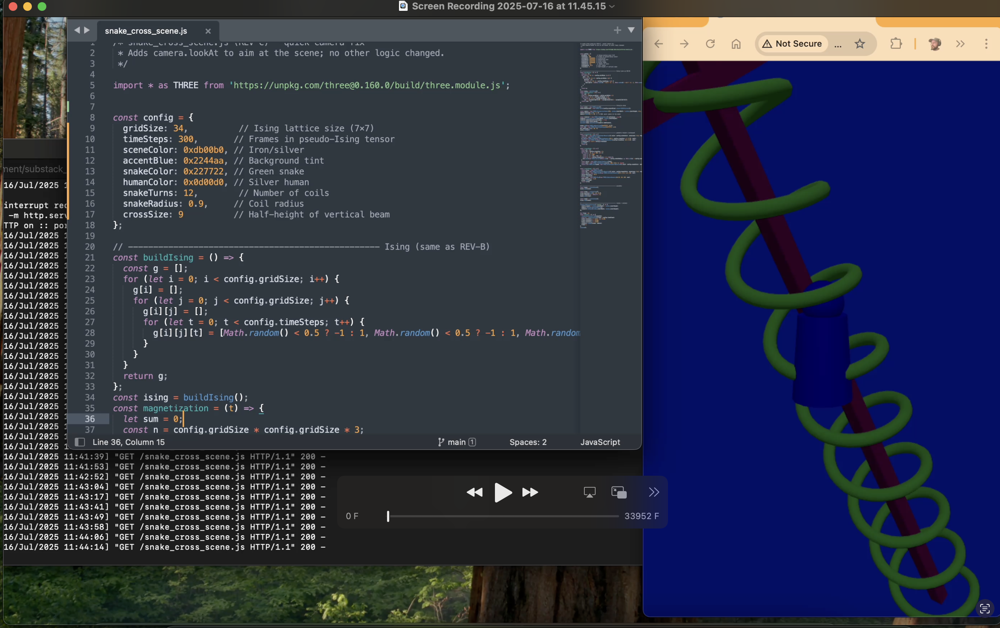

# snake_scene_2025_jul_16

A lightweight **THREE.js** demo that visualises a silver-hued “Abe” figure carrying an iron cross while a green snake coils dynamically around it.  
The snake’s slither speed is driven by a tiny pseudo-Ising 4-D tensor, giving a subtle, non-repeating motion without any heavyweight physics libs.



Animation at [https://www.youtube.com/shorts/4dhOcSGe-k4](https://www.youtube.com/shorts/4dhOcSGe-k4) (evolving daily for now)

---

## ✨ Features
- **Zero-build**: plain ES-modules—open `index.html` directly in Chrome/Chromebook.
- **Parametrised**: tweak colours, cross size, snake radius/turns, or Ising grid size in one `config` object.
- **Pure JS**: no TensorFlow.js (removed after browser-rng compatibility hiccup).

---

## 📂 Project layout

.
├─ index.html            # Minimal launcher
├─ snake_cross_scene.js  # All scene logic (<200 LOC)
└─ docs/
└─ screenshot.png     # Optional: grab your own

---

## 🚀 Quick start
1. Clone / download this repo  
   `git clone https://github.com/<you>/snake_scene_2025_jul_16.git`
2. Open **`index.html`** in Chrome.  
   (A simple `python3 -m http.server` is handy for local hosting.)
3. Enjoy Abe, his cross, and the ever-coiling snake!

---

## 🔧 Adjustable parameters
```js
const config = {
  gridSize: 7,          // Ising lattice size (7×7)
  timeSteps: 300,       // Frames in pseudo-Ising tensor
  sceneColor: 0xaaaaaa, // Iron/silver
  accentBlue: 0x2244aa, // Background tint
  snakeColor: 0x227722, // Green snake
  humanColor: 0xbbbbbb, // Silver human
  snakeTurns: 4,        // Number of coils
  snakeRadius: 0.5,     // Coil radius
  crossSize: 2          // Half-height of vertical beam
};

📝 License

MIT — do anything, just keep the copyright line.

© 2025 Matt Hagy
